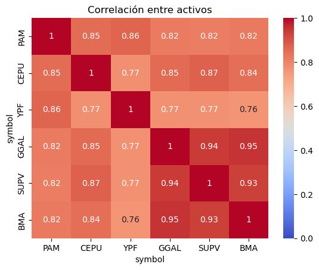
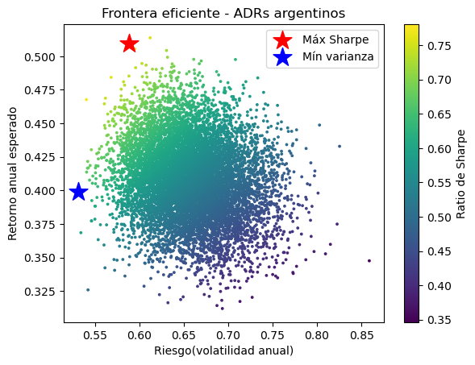
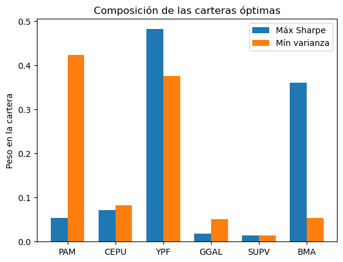
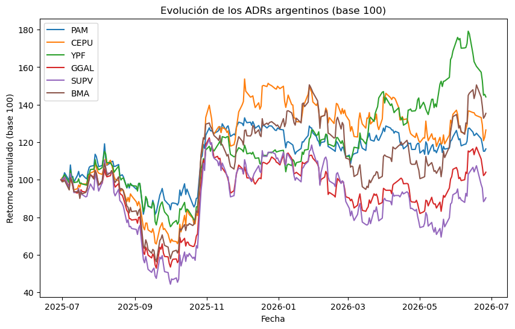

# Optimización de cartera de activos argentinos utilizando el modelo de Markowitz
Seleccioné 6 activos argentinos (3 energéticos y 3 financieros) y construí un portafolio eficiente aplicando la teoría de Markowitz.

## Objetivo
Construir un portafolio eficiente seleccionando 6 activos líquidos: 3 energéticos (YPF, PAM, CEPU) y 3 financieros (GGAL, SUPV, BMA).

## Datos y metodología
Seleccioné 6 ADRs líquidos de los dos sectores que más pesan sobre el MERVAL: energía y bancos. El período analizado va desde el 29-06-2025 hasta el 29-06-2026.
Simulé 10.000 carteras y calculé retornos históricos, matrices de covarianza, la frontera eficiente y el ratio de Sharpe.
Librerías utilizadas: yahooquery, pandas, numpy, matplotlib, seaborn.

## Análisis y resultados

Se observa una alta correlación entre todos los activos seleccionados.

Las volatilidades van de 55% a 85%. La cartera de mayor retorno se ubica levemente por encima del 50% de rendimiento anual.

La cartera de máximo Sharpe se concentra en YPF, mientras que PAM resultó el activo menos volátil y domina la cartera de mínima varianza.

Todos los activos se movieron fuertemente en septiembre de 2025 (elecciones en provincia de Buenos Aires) y en octubre de 2025 (elecciones legislativas nacionales). Los movimientos macro parecen dominar el período analizado.

## Hallazgo central
La diversificación intra-Argentina es limitada: los activos del MERVAL tienen correlaciones altas (0,68–0,93). El riesgo macro domina sobre el análisis micro que pueda hacerse de cualquier empresa individual.

## Limitaciones
Todo análisis histórico no es predictivo, y no recomiendo construir un portafolio basándose en retornos pasados. Conviene complementar con análisis macro y de contexto país, que en Argentina domina sobre los fundamentos individuales.

## Cómo correr el proyecto
Requisitos: Python, pandas, numpy, matplotlib, seaborn, yahooquery. Al correr el script se descargan los datos y se generan los gráficos.
